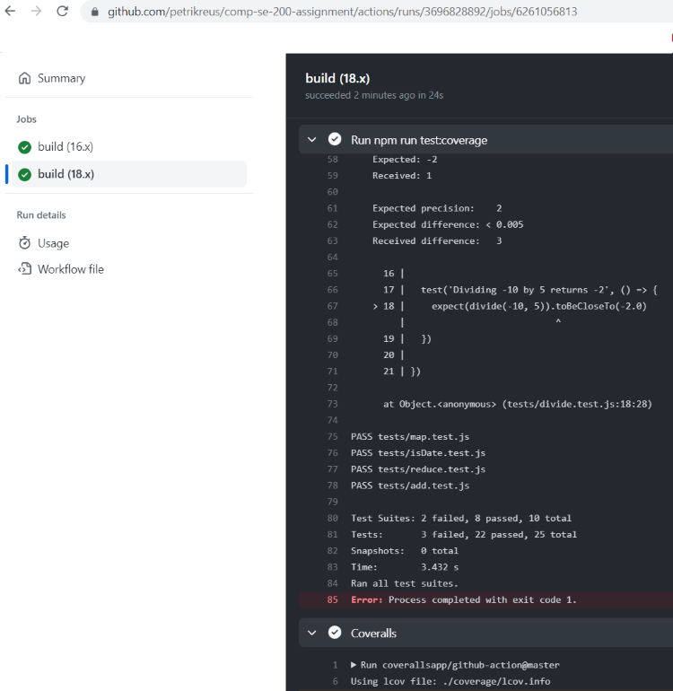

# Cover page

- Name of the document,
- course ID and course name,
- the names of students as well as the student numbers,
- and the URL to the GitHub repository.

# Definitions, acronyms and abbrevations

- List of any definitions, acronyms and abbrevations used in the document.

# Introduction

- Short introduction to the contents of the document.
- What is in the document?
- What is the purpose of the document?

This documents contains a report of the testing process for the utility library of the front-end of the E-Commerce
Store application. The aim of this document is to give a thorough description of what was tested, how the tests were
run and what were the results. Additionally, some things were missing from the plan and are described for the
clarification.

The report begins with a description of the target of the testing and a list of issue categorization in Section 2.
Next, section 3 gives an overview of the tests and the GitHub Actions workflow, in addition to instructions of how
to run the tests. Finally, section 4 provides our findings and conclusion of the testing process.

# Definition of done

- when has the test target as a whole passed testing
- example of bug/issue report to ease the burden of documentation, and a pre-defined list of bug/issue categorization (
  e.g. bug severity rating such as minor, medium, major).

This section provides complementary information that was missing from the testing plan.

The target of the testing is to test the most critical parts of the utility library. The files chosen for the tests are
essential for the front end using the utility library, which is why all tests must pass, until the testing is deemed as
passed.

The severity rating of the bugs from the least critical to the most critical is 

- minor
- medium
- major.

# Tests & CI pipeline

- Add a description of your tests and GitHub Actions workflow.
- Include instructions on how to run your unit tests and generate coverage report locally.


## Description of the tests

## Running the tests locally

The tests can by run locally from a terminal by navigating to the project root folder. First install required dependencies by running the command: 

```
$   npm install
```
You can run the unit tests without coverage in the terminal with the command:

```
$   npm run test
```
You can run the tests with coverage with the command:

```
$   npm run test:coverage
```
When locally running tests with coverage, the coverage report can be found from a folder named **coverage** from the project root folder. Path to the summary report is the following:
```
.\coverage\lcov-report\index.html
```


## CI pipeline and coveralls

Node.js starter workflow template (By GitHub Actions) was used as the base for the continuous integretion and testing workflow for this project. The workflow will do a clean installation of node dependencies, cache/restore them and run tests across different versions of node. Build of the source code was obviously omitted since the actual web store application is not implemented in the scope of this assignment.

The workflow will be triggered on push events and pull requests to the main branch of the repository. The jobs to run on Linux, using the GitHub-hosted ubuntu-latest runners.

The starter workflow includes a matrix strategy that builds and tests the code with different Node.js versions. Our workflow uses Node versions 16.x and 18.x. The 'x' matches the latest minor and patch release available for a version. The jobs of the workflow are run on each of the specified Node versions separately. We had issues with Node version 14 when running our tests and not enough time to debug and fix the issue, so Node version 14 was dropped from the workflow.

The workflow runs the following commands:

```
$   npm ci
```
which does a clean install of the applications dependencies and

```
$   npm run test:coverage
```

which runs the Jest unit tests with coverage and coveralls. Then the work flow posts the test suite's LCOV coverage data to coveralls.io.

**TODO add a screenshot of your working GitHub Actions workflow and test results (both from GitHub), in addition, add either a publicly accessible link to your Coveralls reports or screenshots of the reports on Coveralls.**



From the [Coveralls report](https://coveralls.io/github/petrikreus/comp-se-200-assignment?branch=main) you can view the test coverage information.


## Bug report template

|                        |                                                                                  |
|------------------------|----------------------------------------------------------------------------------|
| ID                     | Unique ID                                                                        |
| Title                  | Descriptive report title                                                         |
| Description            | Description of the issue / error / failure                                       |
| Reported by            | Person who created the bug report                                                |
| Reported Date          | When was the report created                                                      |
| Name of the Program    | Name of the program under testing                                                |
| Testing configuration  | Information on testing configuration                                             |
| Report type            | Programming error, design error, conflict with documentation, proposal, question |
| Failure repeatable     | Yes, No, Sometimes, Unknown                                                      |
| Seriousness            | Major, Medium, Minor                                                             |
| How to repeat          | Instructions how to repeat / re-produce the issue                                |
| Recommended fix        | Suggestion for fixing the issue                                                  |
| Assigned to            | Person responsible for reviewing and fixing the bug                              |
| Status                 | New, Assigned, Fixed, Verified, Re-open, Won't Fix, Closed                       |
| Comments               | Free-form comments.                                                              |


# Findings and conclusions

- Make reports of any bugs or issues you happen to find (if any).
- Estimate on the overall quality of the tested library. Did it pass your tests? Is it ready for production? Should
  it be used with the E-Commerce application? Is the E-Commerce application ready for production?
- Estimate the test coverage. Was the library "fully tested"? How about the E-Commerce application? Is there a need
  for further tests?


# References

- List of any and all references used in the document. Add URL links in references (as opposed to inline links within
  the text).
- [Building and testing Node.js](https://docs.github.com/en/actions/automating-builds-and-tests/building-and-testing-nodejs)
- [Coveralls GitHub Action](https://github.com/marketplace/actions/coveralls-github-action)

